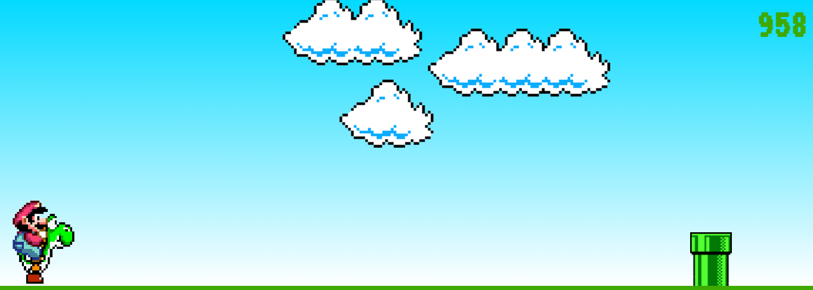
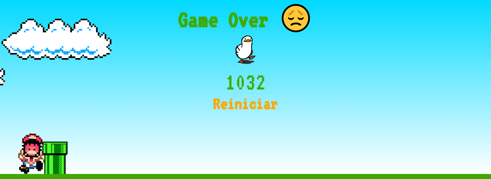

# Jogo do Mario Web

Esse jogo tem como objetivo possibilitar que os usuarios que navegam na web se dirvitam com o jogo do mario!!

## Tecnologias usadas: 
<ul>
   <li>JavaScript</li>
   <li>CSS3</li> 
   <li>HTML5</li> 
</ul>

## Apresentação:
 
### Tela Inicial: 

Tela de Jogo: 

Tela de GameOver:

